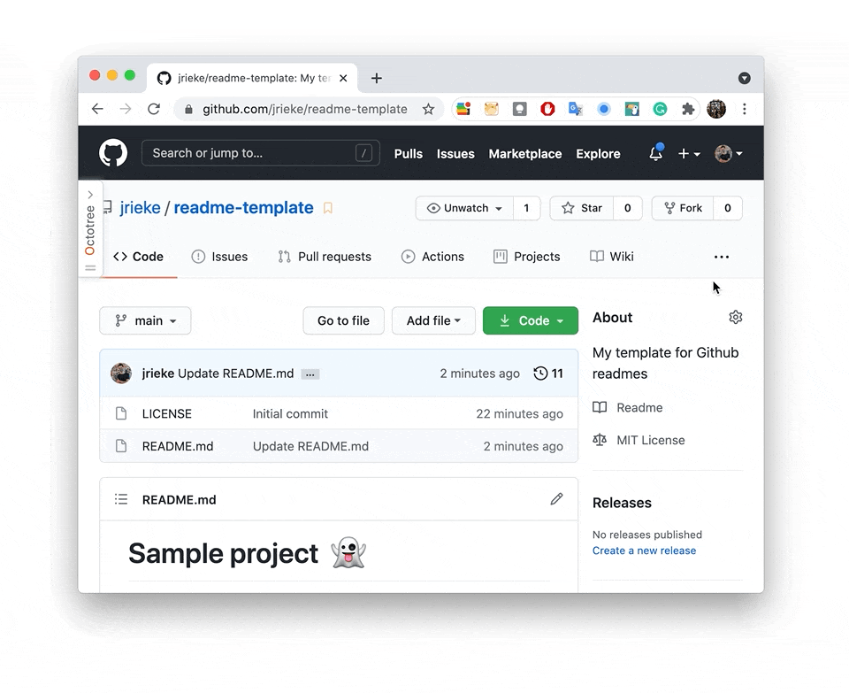

# Sample project &nbsp;🚀

[](https://shields.io/)

**This one sentence explains your project in simple words.**

Add some more description of your project here. Try to keep it short but explain most features. Three to five lines of text are usually good. Link to frameworks and tools that you integrate. 

<sup>If needed: Alpha/Beta version, use with care.</sup>

---

<h3 align="center">
  🎉 <a href="https://github.com/jrieke/readme-template">Try it out</a> 🎉
</h3>

---

<p align="center">
    <a href="https://github.com/jrieke/readme-template"></a>
</p>


## Installation

```bash
pip install sample-package
```

You can add some more detailed instructions here. Don't forget to mention any special dependencies.


## How to use it

```python
import sample_package

sample_package.do_something()
sample_package.do_something_else()
```

Add some description of what will happen. Or an image. Or the terminal output of the command above. One to three paragraphs of text is a good guideline here. Ideally, the user should be able to run a simple example with this instruction. Anything more advanced can go to the section below. 


## More options

- Here's something else you can do:

  ```python
  sample_package.super_advanced_func()
  ```

- Also, there's feature X. 

- If you already have a lot of features, you can split this up into several sections.


## TODOs

PRs are welcome! If you want to work on any of these things, please open an issue to coordinate.

- [ ] List a few things you want to do
- [ ] The idea is to give people an idea of where you are headed, so they can easily help you if you wannt to
- [x] ~~If an item is done, you can strike it through, so people know you already worked on it~~
